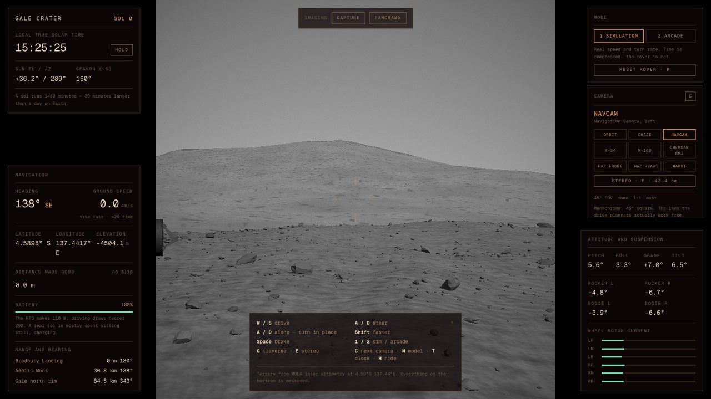
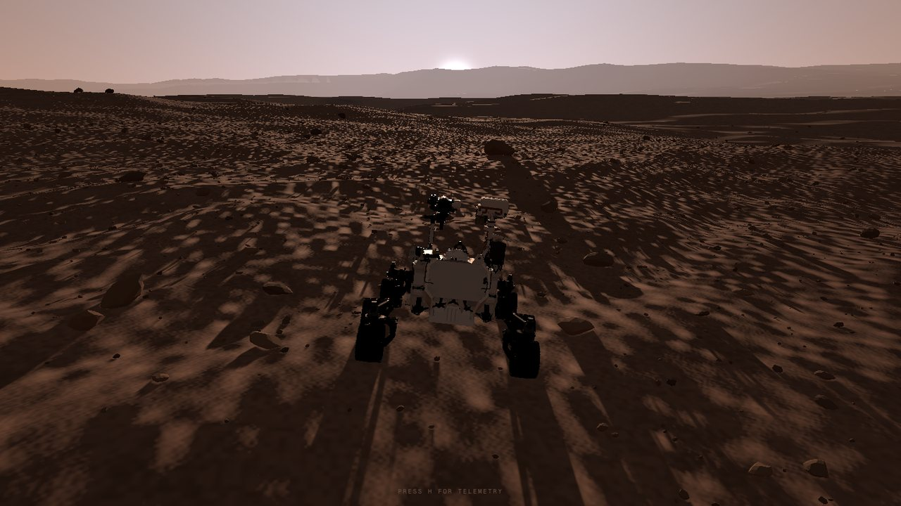
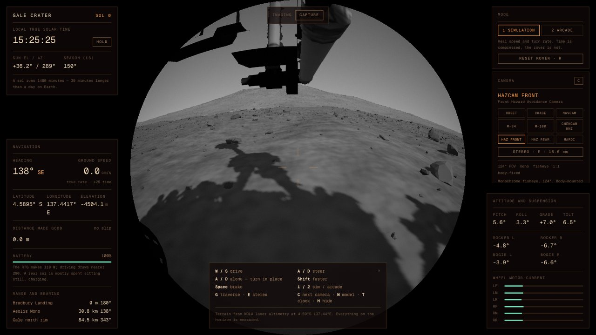
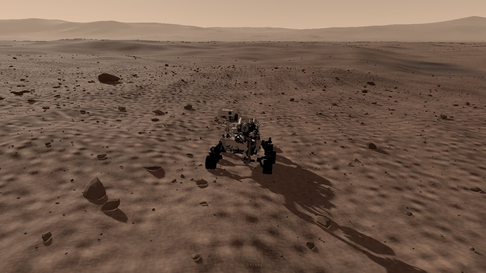

# Gale Crater

**A drivable Mars rover sandbox in the browser.** Six-wheel rocker-bogie
suspension, a real Gale Crater height field from laser altimetry, and Mount
Sharp on the horizon where it actually is.

No goals, no score. Drive around and look at Mars.

### [→ Open it](https://oddurs.github.io/rover/)



<sub>Mount Sharp, 31 km away, through the left Navcam — monochrome and square,
because that is what the detector produces.</sub>

---

## Quick start

```bash
pnpm install
pnpm dev
```

The terrain and both rover meshes are committed, so a clone runs immediately.
Python tooling is only needed to regenerate them — see [docs/DATA.md](docs/DATA.md).

```bash
pnpm verify     # lint, typecheck, production build
pnpm deploy     # build and publish to the gh-pages branch
```

## The premise

Almost everything here is measured, and the parts that are not are labelled.

- The crater rim is 84 km north-north-west because MOLA measured it there.
- The rover drives at 4.2 cm/s and turns in place at 1.5°/s, a figure that falls
  out of its own top speed and its wheel geometry rather than being chosen.
- The terrain's colour came off a Curiosity Mastcam frame, sampled at three
  luminance percentiles.
- Sunsets are blue near the sun because 1.5 µm dust scatters forward, and more
  strongly at short wavelengths.
- Seven cameras carry the fields of view of the real instruments, derived from
  published detector sizes and IFOVs.

What is invented — the sub-460 m terrain detail, the clast field, arcade mode —
is set out plainly in [docs/DATA.md](docs/DATA.md#what-is-not-real).

|  |  |
|---|---|
|  |  |
| The sunset really is blue near the sun. | The front Hazcam: monochrome fisheye, 124°. |

## Contents

- [The terrain is real](#the-terrain-is-real) · [The horizon](#the-horizon) · [The ground](#the-ground)
- [Two modes](#two-modes) — simulation and arcade
- [Two rovers](#two-rovers) — Curiosity and Perseverance
- [The sky](#the-sky) · [Rendering](#rendering) · [Colour grade](#colour-grade)
- [Looking through the instruments](#looking-through-the-instruments)
- [The traverse](#the-traverse) · [Controls](#controls) · [Deep links](#deep-links)

---

## The terrain is real

The landform comes from **MOLA** — the laser altimeter that flew on Mars Global
Surveyor and fired nearly 600 million shots at the surface between 1997 and 2001.
`tools/extract_mola.py` pulls a 415 km window centred on Bradbury Landing out of
the MEGDR archive at NASA's PDS Geosciences Node and writes a web-ready height
field.

Everything above about 460 m in scale is measured, not invented: the crater rim
84 km to the north-north-west, the 5 km rise of Aeolis Mons 31 km to the
south-east, the slope of the crater floor under the wheels. Drive toward the
mountain and you are following the same bearing Curiosity did.

The output ships as a raw `uint16` buffer rather than a PNG, because browsers
quietly truncate 16-bit PNGs to 8 bits in canvas — which would quantise 6.6 km of
relief into 20 m steps and visibly terrace the mountain.

## The horizon

Mars is small — a third of Earth's radius — so the horizon is close: about
3.7 km from a two-metre eye height. The terrain is modelled on a flat plane, so
without correction the ground simply keeps going and the horizon never arrives.
The vertex stage drops the surface away as the square of the distance from the
viewer, which puts the horizon where it belongs, hides far terrain the way the
planet actually hides it, and makes distant relief rise *out* of the skyline
rather than sit on top of it. At the north rim, 84 km out, that drop is over a
kilometre — which is why the rim reads as a low ridge rather than a wall.

Aerial perspective uses its own colour rather than the sky's. The bright band
hugging the horizon and the solar disc are properties of the *sky*; painting
them onto a hillside twenty kilometres away makes far ground come out brighter
than the sky above it, which reads as fake instantly — distant relief should sit
at or just below the tone behind it.

The clipmap reaches 131 km so the rim is in the scene at all. Above the horizon
there is a distinct brighter band in the last few degrees: the line of sight
there runs through far more suspended dust than it does overhead, and that is
what stops a Mars sky reading as a plain vertical gradient.

## The ground

Modelled on Curiosity's own Mastcam frames of Gale rather than invented. Two
things are obvious in those images and neither was true of the first version of
this: the surface is a *continuous pavement* of clasts rather than a few
boulders on smooth sand, and the clasts are angular, platy fragments of broken
bedrock rather than rounded stones. Ground cover is now three tiers — gravel,
cobbles, blocks — of faceted, flattened, flat-shaded fragments, bedded into the
regolith rather than resting on it.

The palette is measured, not guessed. Sampling the ground region of PIA25175 at
the 25th/50th/75th luminance percentiles gives the terrain's four albedo
constants directly. The real surface is a mildly warm grey-brown — R/G is only
1.20 in sRGB, saturation about 0.13 — far less saturated than Mars is usually
drawn. That product is white balanced, so it approximates *reflectance*; the
Martian illuminant is supplied separately by the sun colour, which is the
physically right way round.

### What is *not* real

MOLA resolves nothing finer than 463 m per post, and the rover is 3 m long. So
everything below that scale — the metre-to-hundred-metre roughness, the aeolian
ripples, the boulder fields — is procedural, layered on top of the measured
landform. Without it a 463 m dataset reads as putty under the wheels. Rock
placement is a deterministic hash of position, so a given boulder is always in the
same place.

The dark basaltic sand and dust tinting are plausible, not mapped. There is no
orbital imagery draped over the terrain.

## Two modes

Press **1** and **2**.

**Simulation** does what Curiosity does. It drives at 4.2 cm/s, turns in place at
1.5°/s — a figure that falls straight out of that speed and the wheel geometry
rather than being picked — slips on slopes, and runs a battery the RTG cannot
refill fast enough to drive continuously. Because 4.2 cm/s is unwatchable, the
mode compresses *time* rather than speeding up the vehicle: the clock, the sun
and the rover all advance at the same multiple, so you are watching a time-lapse
of a real drive rather than a rover that has been made fast. Slip is visible
from outside, because the wheels keep turning at the commanded rate while the
ground gives back less — which is why the odometry and the distance actually
made good are two different readouts.

**Arcade** throws that out and models a free rigid body.

*Grip* is the whole handling model: how fast the velocity vector swings back
into line with where the hull is pointing. High and the rover goes where it
points; pull the handbrake (**X**) and it barely does, so the nose comes round
while the rover keeps travelling the way it already was. Measured: 0° of slip
cruising, 4° steering on grip, **63° on the handbrake** — a handbrake turn.

*Jumps* (**Space**) squat onto the suspension for 160 ms and then throw, rather
than teleporting upward. In flight there is no steering, because nothing is
touching the ground to push against — though the wheels still spin and still
point wherever you aim them. The hull carries a full orientation quaternion and
an angular velocity seeded from whatever rate the terrain was already rotating
it, so driving off a crest keeps the nose dropping. Land past 60° from upright
and it stays on its back until you reset it (**R**, or the on-screen button).

Landing runs a damped spring rather than an exponential fade, which is the
difference between absorbing an impact and simply forgetting it: about 10 cm of
travel, one overshoot, and a rock away from whichever corner touched first —
scaled by how badly the attitude disagreed with the ground, so coming down
matching the slope barely stirs it. The hull also *slerps* out of its flight
orientation over ~0.13 s instead of snapping to the terrain solution in a
single frame.

The spring integrates implicitly. Explicit integration of a stiff damped spring
is only stable while `c · dt < 1`, which at this damping breaks above a 48 ms
frame — and `dt` is clamped at 50 ms. One slow frame used to overshoot the
damping term, flip the velocity's sign and throw the impact away, which is what
made landings feel erratic. Solving for the new velocity instead is
unconditionally stable, so a landing looks the same at 15 fps as at 120.

Measured arc: 5.69 m peak, 3.45 s hang, 0.25 rad/s of tumble.

*Crests throw it off the ground on their own.* Wheels can only push, never
pull, so contact is lost the moment the curvature the hull is being asked to
follow demands more than gravity can supply — convexity × v² > g. In 3.72 m/s²
that is a low bar: at 15 m/s any crest tighter than a 60 m radius does it, and
under boost the figure is 276 m. Driving fast here means spending a good part of
the time just off the ground, which is why steering still bites while the wheels
are within half a metre of it — losing all control on every rise would make the
thing undriveable. The curvature is measured over a baseline wider than the
wheelbase, because the suspension swallows anything shorter than the vehicle.

*The suspension works the whole time.* Writing the body's height as a spring
between it and the surface, the compression obeys u'' = a_ground − k·u − c·u',
so the vertical acceleration the terrain imposes is a forcing term — feed it in
and the hull lags each rise, compresses, and pushes back, instead of only
reacting when it lands. Measured while crossing rough ground at 15 m/s: 4–6 cm
of travel and about 2° of rock, continuously.

## Colour grade

Backtick opens a grading panel. Exposure, contrast about a mid-grey pivot,
saturation, a warm/cool axis, black point, and split toning that pulls shadows
one way and highlights the other — the linear-light half of which runs before
the transfer function, which is what stops the toning looking like a coloured
sheet laid over the top. Presets include a modern Mars-film look, a flat
documentary grade, and a faded 1976 one.

Any Adobe `.cube` 3D LUT can be loaded on top. `sampler3D` does not exist in the
GLSL version this pass compiles as, so the cube is laid out as N slices side by
side — N² wide by N tall — and the shader blends between two slices by hand. It
is applied after the transfer function, which is where a display LUT belongs.

## Two rovers

Press **M** to swap between them.

**Flight model** — NASA/JPL-Caltech's published Curiosity mesh. It ships as a
single fused node with no hierarchy and no skins, so nothing in it can move as
delivered. Connected-component analysis (`tools/segment_rover.py`) shows the six
wheels *are* separate shells sharing one material, and nothing else uses that
material, so they get lifted out at load time and hung on their own pivots. The
rocker-bogie arms are not separable from the hull, so on this model the
suspension is rigid.

One trap worth recording: web-optimising the GLB applies `KHR_mesh_quantization`,
which stores positions as normalised 16-bit integers with a compensating scale on
the node. The renderer understands that; manual geometry surgery does not, and
reading the raw arrays yields wheels 65,000 units across. Everything is
denormalised through `getX`/`getY`/`getZ` before being touched.

11.86 MB → 1.06 MB after webp textures and meshopt.



**Perseverance** — the Mars 2020 mesh, which is far better built: 66 named
nodes, so the wheels come out of a single `Wheels_objs` object. Its wheels
measure 0.525 m against Curiosity's 0.50 m, exactly as the real redesign did.
Its suspension is also one object, so it too is rigid.

Both are placed by fitting a least-squares plane through their six contact
points, which is the right way to seat a vehicle whose suspension cannot move.
The difference that makes is measurable: mean clearance lands on 0.25 m either
way, but the spread across the six wheels is 65 mm rigid against 5.7 mm for the
articulated engineering model. That gap *is* what rocker-bogie does.

**Engineering model** — built from primitives and the only one whose linkage
actually articulates. Reach it with `?model=engineering`.

## The suspension

Rocker-bogie is a passive linkage: a *rocker* pivots on the chassis with the front
wheel at one end and a *bogie* at the other; the bogie carries the middle and rear
wheels. A differential bar across the hull ties the two rockers together, so the
chassis pitches to the average of the two sides and keeps all six wheels loaded
over obstacles up to about a wheel diameter tall.

It is solved **kinematically**, not with rigid-body physics: sample the ground
under each wheel, then work up the linkage to find the bogie pivot, the rocker
pivot, and finally the chassis attitude. This cannot explode, jitter, or launch the
rover into orbit, which matters more for a sandbox than simulating joint torques.
`tools/contact.mjs` measures the result — all six wheels typically sit within a
centimetre of each other on undulating ground.

The wheels are placed on the CPU while the ground is displaced on the GPU, so both
sides evaluate the same height function. `lib/noise.ts` keeps a TypeScript and a
GLSL simplex implementation in lockstep for exactly that reason.

## The sky

Mars' atmosphere is dominated by suspended dust about 1.5 microns across, which
scatters forward far more than back, and does so more strongly at short
wavelengths. The daytime sky away from the sun is therefore butterscotch — and at
sunset, looking almost straight through the forward-scattering lobe, the glow
around the sun turns **blue**. That inversion of Earth's sky is real. Scrub the
clock to about 17:50 and look west.

Solar position is computed properly from latitude, hour angle, and a declination
derived from Mars' 25.19° obliquity and the season (Ls), so shadows fall where they
should through the sol and across the Mars year.

## Rendering

A geometry clipmap: eleven concentric rings of fixed grid geometry centred on the
rover, each ring twice the cell size of the one inside it, from 0.5 m under the
wheels out to 32 km. The geometry never changes — only a centre uniform — so
roaming is free, with no mesh rebuilds to stutter on. Vertical skirts at each ring
boundary hide the cracks where resolutions meet.

The terrain is a `MeshStandardMaterial` with the height field injected into the
vertex stage rather than a bare `ShaderMaterial`. That costs some control and
buys real shadow maps: rocks and the rover lay genuine shadows across the ground,
which at low sun is most of what sells the place. One catch — a geometry with no
`normal` attribute makes three fall back to flat shading, which both facets the
terrain and removes the `vNormal` varying, so the clipmap carries placeholder
normals that the shader overwrites.

Exposure opens as the sun drops, the way an eye or a camera would; without it the
last hour before sunset just reads as muddy.

Shadow bias is worth a note: a 4096 map over a 52 m frustum is ~13 mm per texel,
tight enough that the normal bias can stay at 15 mm. A larger one visibly
detaches gravel from its own shadow, which reads as everything floating.

## Controls

| | |
|---|---|
| `W` / `S` | drive |
| `A` / `D` | steer |
| `A` / `D` with no throttle | turn in place |
| `Shift` | faster |
| `C` | cycle camera |
| `M` | swap rover |
| `E` | stereo anaglyph |
| `G` | show the real traverse |
| `1` / `2` | simulation / arcade |
| `Space` | brake (sim) · jump (arcade) |
| `X` | drift (arcade) |
| `T` | hold the clock |
| `H` | hide telemetry |
| drag, in a mast view | slew the mast |

## Looking through the instruments

Seven of Curiosity's cameras, each with the optics of the real thing. Fields of
view come from published detector sizes and instantaneous fields of view rather
than round numbers from memory:

| | field of view | frame | |
|---|---|---|---|
| Navcam | 45° square | 1:1 | monochrome |
| Mastcam M-34 | 20° × 15° | 4:3 | colour |
| Mastcam M-100 | 6.8° × 5.1° | 4:3 | colour telephoto |
| ChemCam RMI | 1.15° | circular | monochrome |
| Front / Rear Hazcam | 124° | circular | monochrome fisheye |
| MARDI | 70° × 52° | 4:3 | colour, pointing straight down |

Frame *shape* matters as much as angle, so each view is masked to the shape its
detector actually produces — a Navcam frame is square, a Mastcam frame is 4:3 —
rather than stretched to fill a widescreen window. The monochrome views are
monochrome because those detectors carry no colour filter array.

The Hazcam fisheye is a real remap, not a lens effect: the scene is rendered
rectilinear at whatever field of view puts the fisheye's edge ray on the frame
boundary, then resampled so output radius is proportional to angle off-axis,
which is what *equidistant* means. A 124° fisheye needs a 124° rectilinear
render to feed it, so the source corners are stretched thin — the circular mask
that real Hazcam frames have anyway keeps that out of shot.

Mast instruments ride the mast head, so dragging slews them exactly as it slews
the real ones. Body instruments are bolted to the hull and don't slew at all,
which is rather the point of a hazard camera. Mount positions are placed from
published rover dimensions and the geometry of these meshes, not flight CAD.

MAHLI is absent: it lives on the arm turret, and the arm is fused into the
flight mesh, so there is nowhere dependable to hang it.

### Stereo

Navcam and Mastcam are stereo *pairs*, and their baselines are published — 42.4
and 24.2 cm. Press **E** and the scene renders twice at the real separation and
composites red/cyan. Because the Navcams and Hazcams carry no colour filter
array their frames are already grey, so the anaglyph has no colour rivalry at
all. Parallax falls off with distance exactly as it should: rocks a couple of
metres away separate hard, Mount Sharp at 30 km does not move.

Each eye gets the detector's response *before* the two are combined. Applying
the monochrome conversion afterwards simply flattens the anaglyph back to grey.

### Panoramas

A rover cannot take a wide picture. It takes a lot of narrow ones and slews
between them, and the panoramas everyone has seen are stitched from dozens of
frames afterwards. **PANORAMA** does the same: step the mast, let the terrain
settle, capture the frame, step again. A Navcam sweep is ten frames and comes
out 4600 × 460, covering the full 360° — including, inevitably, the rover's own
hardware.

Tiles are read out of a render target rather than off the canvas, because
reading the drawing buffer after a frame has been presented is undefined
without `preserveDrawingBuffer`, which would cost something on every frame for
the sake of one that happens rarely.

### Filters

Both Mastcams carry an eight-position filter wheel: a clear one that passes
Bayer colour, six narrow science bands, and a solar filter dense enough to point
straight at the sun and see nothing else. Science frames come back as
single-band greyscale, not colour, which is why the colour products are
composites. Band centres and wheel layout are real; the response curves over
rendered RGB are an approximation, and the near-infrared bands extrapolate from
red because there is no infrared here to sample.

### Targeting and capture

Click anything in a rectilinear mast view and the mast slews to put it in the
centre, at actuator rate. The terrain is displaced in the vertex shader, so
three's raycaster — which only ever sees the flat source mesh — would miss it
entirely; the ray is marched against the same height function the wheels use and
then bisected. Clicking 260 px right of centre in a 45° Navcam frame commands
0.277 rad, against a geometric answer of 0.276.

**CAPTURE FRAME** writes the current view to a PNG with a label bar carrying
instrument, sol, local true solar time, field of view and filter — because a
frame without that is a screenshot, not an observation.

## The traverse

Press **G**. This is Curiosity's actual route: 1,371 localised positions from
NASA/JPL's MMGIS, sol 3 to sol 4977, **37.99 km** driven, ending 14.1 km from
the landing site at bearing 193° and a kilometre up the side of Mount Sharp.
Nothing is interpolated — every point is somewhere the rover really stopped, and
consecutive points are never more than 129 m apart.

It is drawn as a ribbon rather than a line, because a GL line is one pixel wide
on most hardware whatever you ask for, and its heights are recomputed against
the same band-limited height field and the same curvature the terrain shader
uses. Without that the far end would float thirty metres above the ground it is
meant to be lying on.

### Speed

Curiosity's actual top speed is **4.2 cm/s**. A faithful sim is unplayable — you
would cross a football pitch in forty minutes — so the default runs at ×120,
adjustable under ENVIRONMENT. The HUD always shows the true rover-equivalent speed
alongside the simulated one.

## Deep links

Any view can be shared as a URL:

```
/?hdg=138&cam=navcam        # Mount Sharp from the navigation camera
/?hdg=282&cam=navcam&t=17.9 # the blue sunset
/?ls=250&t=6.2              # a winter dawn
```

`hdg` heading in degrees, `t` local true solar time, `ls` season, `cam` one of
`orbit` / `chase` / `navcam` / `mastcam`, `model` one of `flight` /
`engineering`.

## Layout

```
lib/terrain.ts     height field — MOLA lookup + procedural detail, CPU and GLSL
lib/noise.ts       simplex noise, mirrored TypeScript/GLSL
lib/clipmap.ts     LOD ring geometry
lib/rover.ts       rocker-bogie solver, Ackermann steering
lib/sky.ts         atmospheric scattering
lib/mars.ts        constants and solar geometry
lib/landmarks.ts   landmarks found in the elevation data, not hard-coded
tools/             terrain pipeline and headless-browser checks
```

---

## Verifying visual work

Rendering bugs do not show up in a diff, so the repo carries tools that drive
the app in a real browser and measure it — wheel-to-ground clearance, jump
height and hang time, how a landing settles, how often crests throw the rover
off the ground, whether the LUT lookup is neutral. Several exist because a bug
survived review and only a measurement caught it. See
[CONTRIBUTING.md](CONTRIBUTING.md#verifying-visual-work).

## Contributing

Very welcome — see [CONTRIBUTING.md](CONTRIBUTING.md). The one rule that matters
is that anything claimed to be real has to be real, and anything invented has to
say so.

Accuracy reports are the most valuable thing this project can receive. If a
number, a position, an optic or a colour is wrong, please
[open an issue](https://github.com/oddurs/rover/issues/new?template=accuracy.yml).

## Licence and credits

Source code is MIT — see [LICENSE](LICENSE).

The NASA data and 3D models redistributed here are **not** covered by that
licence and carry their own terms; see [NOTICE](NOTICE) for what they are and
where they came from. In brief:

- **Terrain** — MOLA MEGDR, NASA PDS Geosciences Node. Smith, D. E. et al.,
  `MGS-M-MOLA-5-MEGDR-L3-V1.0`.
- **Traverse** — NASA/JPL-Caltech MMGIS, `MSL_waypoints.json`.
- **Rover meshes** — NASA/JPL-Caltech.
- **Surface palette** — measured from PIA25175, NASA/JPL-Caltech/MSSS.

This project is not affiliated with, endorsed by, or sponsored by NASA or JPL.
